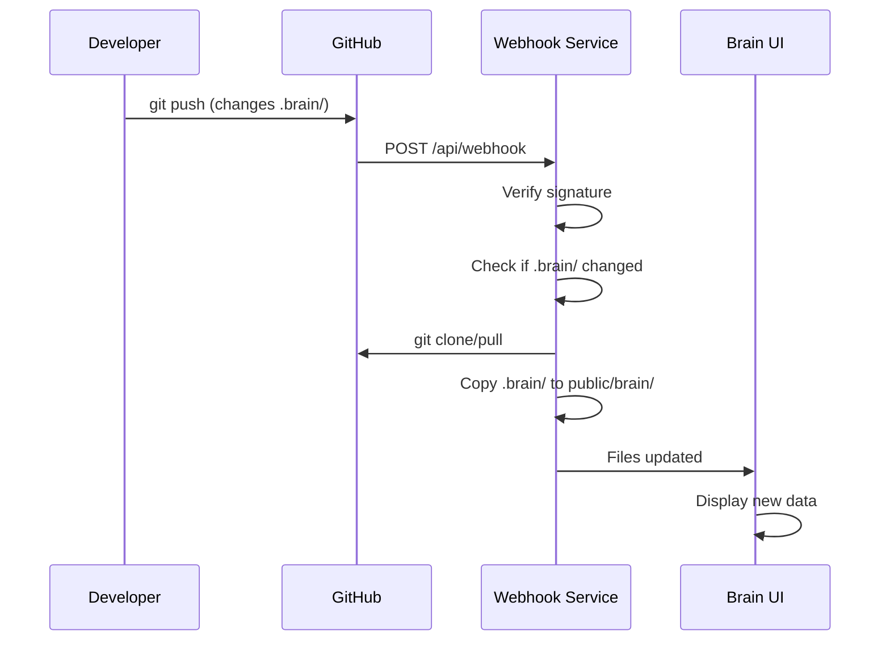

# 🔗 Hướng Dẫn Setup GitHub Webhook

## 📋 Tổng Quan

Hệ thống này tự động đồng bộ dữ liệu từ thư mục `.brain/` trong GitHub repository về Brain UI mỗi khi có commit mới.

## 🛠️ Bước 1: Cấu Hình Local

### 1.1 Tạo file cấu hình

```powershell
# Copy file cấu hình mẫu
Copy-Item .env.webhook.example .env.webhook

# Chỉnh sửa cấu hình
notepad .env.webhook
```

### 1.2 Cấu hình `.env.webhook`

```env
# Tạo secret key mạnh (dùng để xác thực webhook)
GITHUB_WEBHOOK_SECRET=your-super-secret-webhook-key-here

# URL repository của bạn
REPO_URL=https://github.com/your-username/airbnb-webapp.git

# Port cho webhook service (mặc định 8002)
WEBHOOK_PORT=8002
```

### 1.3 Khởi động service

```powershell
# Khởi động development mode
.\scripts\start-webhook-service.ps1 -Development

# Hoặc khởi động production mode
.\scripts\start-webhook-service.ps1
```

## 🌐 Bước 2: Expose Service ra Internet

GitHub cần truy cập được vào webhook endpoint. Có 2 cách:

### Cách 1: Sử dụng ngrok (Recommended cho testing)

```powershell
# Cài đặt ngrok (nếu chưa có)
# https://ngrok.com/download

# Expose local port
ngrok http 8002
```

Ngrok sẽ cho bạn URL như: `https://abc123.ngrok.io`

### Cách 2: Deploy lên VPS/Cloud

- Deploy `webhook_listener.py` lên server
- Cấu hình reverse proxy (nginx)
- Đảm bảo HTTPS

## ⚙️ Bước 3: Cấu Hình GitHub Webhook

### 3.1 Vào GitHub Repository Settings

1. Mở repository trên GitHub
2. Vào **Settings** > **Webhooks**
3. Click **Add webhook**

### 3.2 Cấu hình webhook

**Payload URL:**
```
https://your-domain.com/api/webhook
# hoặc với ngrok:
https://abc123.ngrok.io/api/webhook
```

**Content type:**
```
application/json
```

**Secret:**
```
your-super-secret-webhook-key-here
# (giống với GITHUB_WEBHOOK_SECRET trong .env.webhook)
```

**Which events would you like to trigger this webhook?**
- ✅ Chọn "Just the push event"

**Active:**
- ✅ Đảm bảo được check

### 3.3 Test webhook

1. Click **Add webhook**
2. GitHub sẽ gửi một test ping
3. Kiểm tra logs của service để xác nhận nhận được request

## 🧪 Bước 4: Test Hoạt Động

### 4.1 Test webhook endpoint

```powershell
# Test health check
curl http://localhost:8002/

# Test sync status
curl http://localhost:8002/api/sync/status

# Test manual sync
curl -X POST http://localhost:8002/api/sync/manual
```

### 4.2 Test với commit thật

1. Tạo/sửa file trong thư mục `.brain/` 
2. Commit và push lên GitHub
3. Kiểm tra logs webhook service
4. Xác nhận file được cập nhật trong `brain-ui/public/brain/`

## 📊 Bước 5: Monitor và Debug

### 5.1 Kiểm tra logs

```powershell
# Application logs
Get-Content webhook_sync.log -Tail 20 -Wait

# Sync history
Get-Content sync_history.json | ConvertFrom-Json | Format-Table
```

### 5.2 API endpoints để debug

```
GET  /                     - Health check
GET  /api/sync/status      - Trạng thái sync gần nhất
GET  /api/sync/history     - Lịch sử sync (20 lần gần nhất)
POST /api/sync/manual      - Trigger sync thủ công
POST /api/webhook          - GitHub webhook endpoint
```

### 5.3 Kiểm tra GitHub webhook delivery

1. Vào repository Settings > Webhooks
2. Click vào webhook vừa tạo  
3. Tab **Recent Deliveries** để xem request/response

## ⚡ Workflow Hoạt Động



## 🔒 Security Notes

- ✅ Luôn sử dụng secret strong để xác thực
- ✅ Chỉ xử lý push events
- ✅ Chỉ xử lý main/master branch
- ✅ Không expose repository credentials
- ✅ Sử dụng HTTPS cho webhook URL

## 🛠️ Troubleshooting

### Webhook không nhận được requests
- Kiểm tra URL có đúng không
- Kiểm tra firewall/network
- Xem GitHub webhook delivery logs

### Authentication failed
- Kiểm tra GITHUB_WEBHOOK_SECRET khớp với GitHub setting
- Kiểm tra signature verification trong logs

### Git clone/pull failed  
- Kiểm tra REPO_URL đúng format
- Nếu private repo, cần GITHUB_TOKEN
- Kiểm tra network connectivity

### Files không được sync
- Kiểm tra .brain/ directory tồn tại trong repo
- Xem detailed logs trong webhook_sync.log
- Kiểm tra permissions của thư mục đích

## 📞 Support

Nếu gặp vấn đề:
1. Kiểm tra logs chi tiết trong `webhook_sync.log`
2. Test manual sync: `POST /api/sync/manual`
3. Xem sync history: `GET /api/sync/history`
4. Kiểm tra GitHub webhook delivery logs